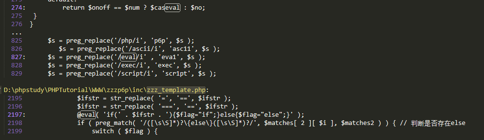
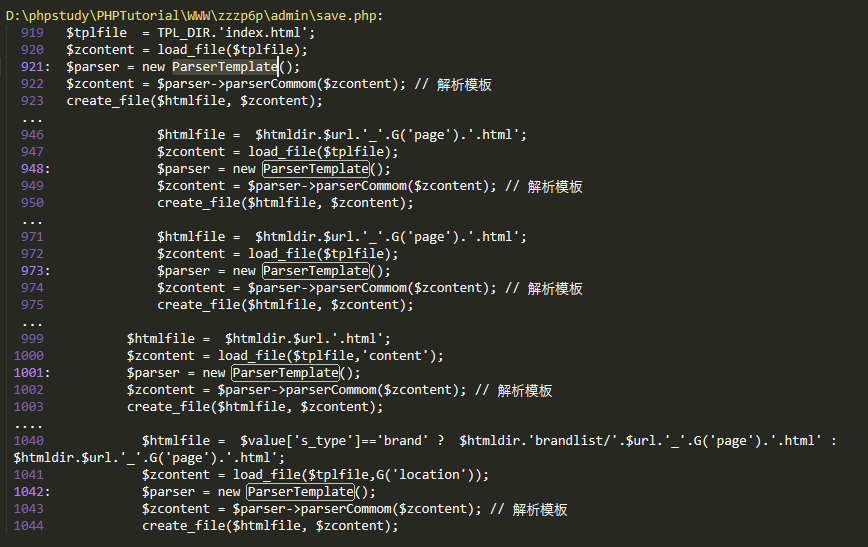
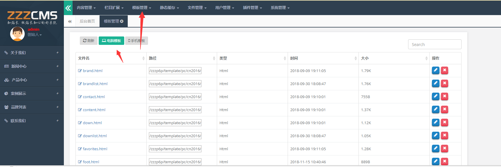

# 0x00 简介

代码执行也是我们经常遇到的，通常是`eval()`、`assert()`，当然还有回调函数比如`call_user_func()` `array_map()`，正则函数，动态调用等等，因为程序对传入的参数过滤不严或者没有过滤，导致代码执行，看过我前面写的php的webshell总结的话，你就会发现很多知识是相辅相成的。

# 0x01 代码执行

这里说说eval的命令执行，assert在php7后面移除了。我们来看一个简单的eval代码执行

test.php
```
<?
$id = $_GET['x'];
eval($id);
?>

```
payload:

```
test.php?x=phpinfo();

```
简单到waf以为他是个webshell了，当然我们实际情况肯定遇不到这么简单的，可能需要多重组合利用，这里下面我以一个实例为例


# 0x02 实战审计

这里使用的是zzzphp V1.6.0的一个解析标签过程中引发的代码执行，网上也有其他人的审计思路，这里我是帮朋友复现的时候弄的。

找个的审计思路是全局搜索eval，当然你也可以搜索其他的能够引发代码执行的函数，但是这个这-1里没有。

路径：\inc\zzz_template.php



我们发现eval里面有变量，那么他是可能存在代码执行的


大概看了下`parserIfLabel()` 函数没有什么过滤，能够达到我们传入任意参数的目的，到了这里我们就是回溯那里调用了这个函数呗，全局搜索下`parserIfLabel()`，没搜索到，看了下是个类，所以搜索类名`ParserTemplate`。



既然 \admin\save.php 调用了我们这个，不妨看看后台那里有模板操作这个



当然完全你也可以回溯代码去分析，但是既然有源码能看就看。


随便找个文件放入我们遵循他正则的代码即可，不过一般我们测试的过程中，尽量选择对目标影响小的文件。

payload：

```
{if:assert(phpinfo())}x{end if}

```
于此同类的还有苹果cms8.x，都是在解析标签过程中出现的问题，一般看到可以自定义解析标签那么就值得注意，命令执行与此类似，这里就不说了。