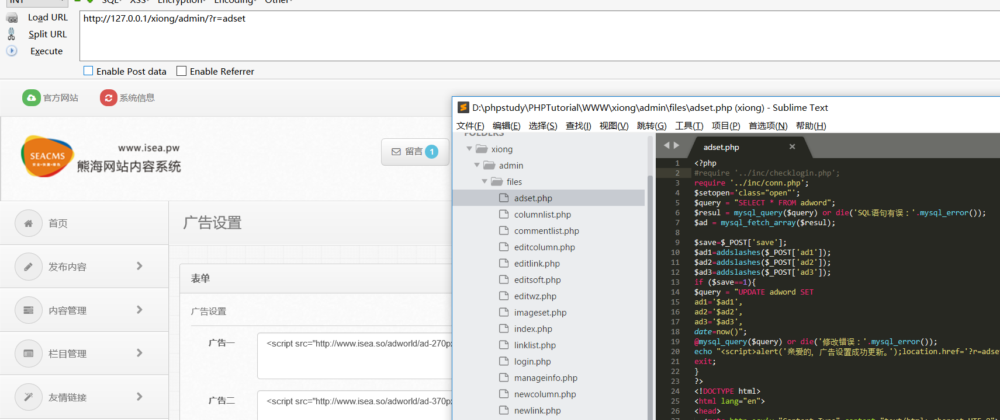
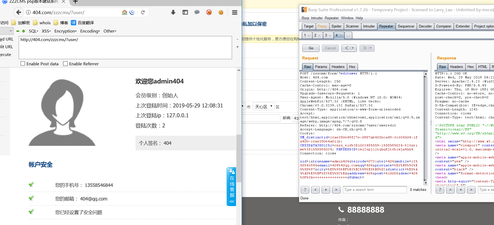
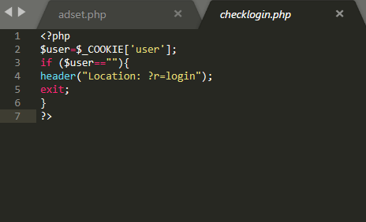
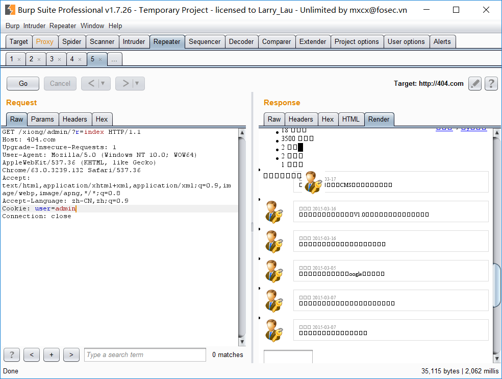
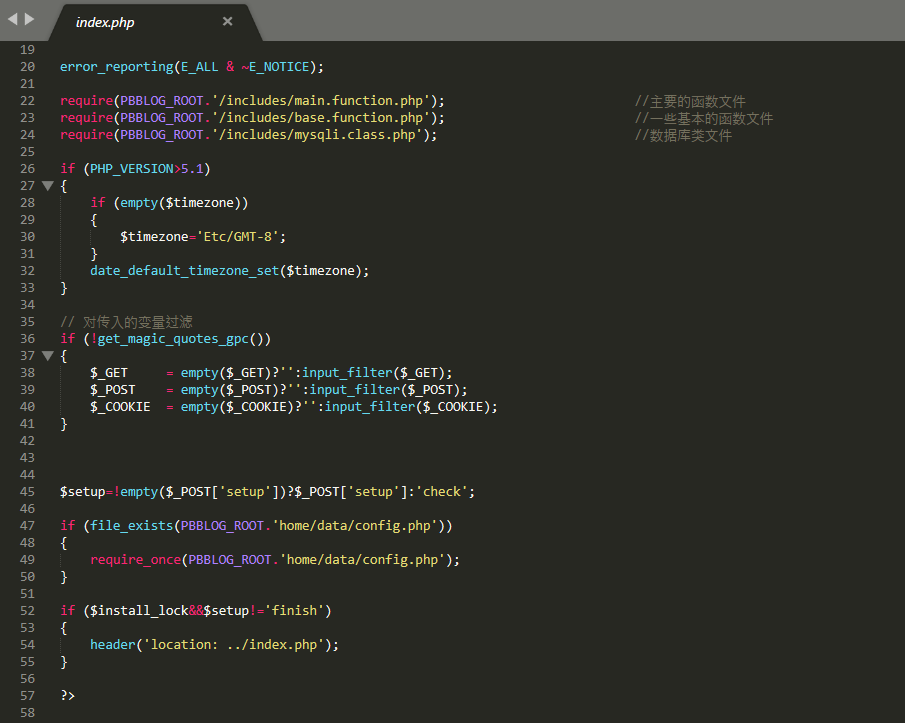
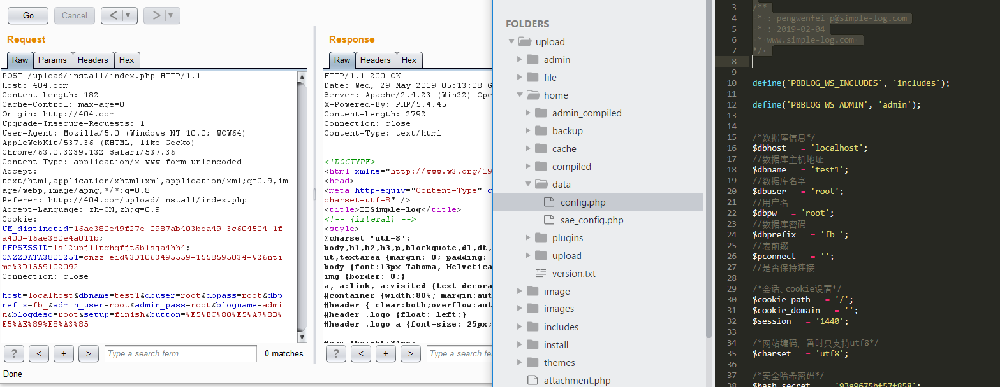

# 0x00 简介

逻辑漏洞是指由于程序逻辑不严，或者函数使用不当，导致发生越权访问，cookies绕过，越权密码修改，重复安装等等问题。一般逻辑漏洞的挖掘需要对代码有一定阅读能力。

# 0x01 越权

越权一般是对cookies的验证不严或者没有验证，一般我们审计后台发现某个功能没有包含验证文件，那么很有可能发生越权操作，当然越权有很多不仅仅局限于一个后台访问的问题。在众多大型网站越权问题也时常发生的，这也是漏洞挖掘中大家都比较喜欢的，有些越权在黑盒测试中或许更加容易发现，所以代码审计大家灵活运用，不要局限了你的思路。越权是个大的专题，我应该是讲不了多少还是请大家多看看文章。

1.**后台越权**：后台某些页面没有引入验证文件

比如这里熊海cms如果我们删除这个验证，那么就可以直接访问这个页面，有很多程序员他会忘记每个页面都添加。

2.**水平越权**：一个用户尝试访问与他拥有相同权限的用户的资源，比如删除收获地址处没有验证权限,导致越权删除其他人的地址。

我们用zzzcms这个程序来做演示 zzzcms\form\index.php

他这里是edituser是没有越权的，我这里只是讲解一下，简单的介绍一下越权如何去审计。我们看这个代码他最后update的时候是修改我们的uid现对的值，而我们的uid是POST包获取的，也就是如果我们可控uid那么就能越权修改其他人的资料。
但是这里有一条验证`$uid != get_session( 'uid' )and back( '很抱歉，资料修改失败' );` 所以没办法越权，为了演示我们可以删除了来看看。

成功把UID为1的用户的资料修改了。

3.**垂直越权**：一个低级用户尝试访问高级别用户的功能。

# 0x02 cookies验证不严

这里用到熊海CMS，我们随便点击一个后台页面，前面包含了一个验证文件`require '../inc/checklogin.php';` 来看看这个文件

判断我们的cookies里面user是否为空，不为空就可以访问后台了。

# 0x03 安装程序逻辑问题

这里找了半天源码发现红日安全写过一个Simple-Log1.6这里就用他这个源码了。

这里他判断是否安装了,然后就直接跳转到主页，而程序没有退出，那么后面的依然可以执行，也就是说直接post后面的程序即可安装。

这类没有正确退出的造成的漏洞还是蛮多的，在后台等地方可以好好关注一下。

# 0x04 文末

当然逻辑漏洞不止就这些，还有其他的问题比如验证码逻辑的绕过，函数的缺陷，推荐大家多看看别人的审计文章。

