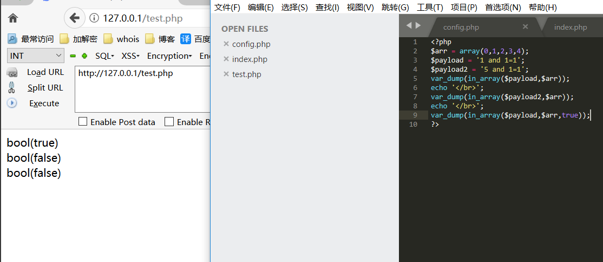
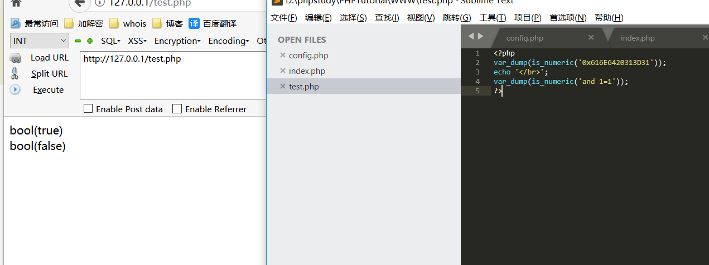
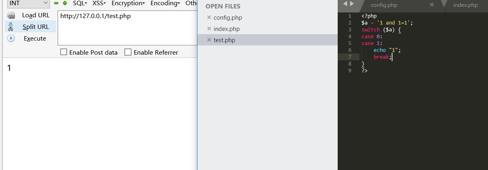
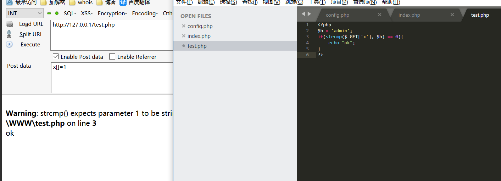
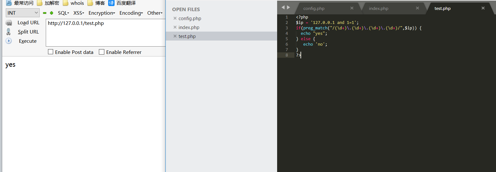

# 0x00  in_array()

`in_array(search,array,type)` 如果给定的值 search 存在于数组 array 中则返回 true。如果第三个参数设置为 true，函数只有在元素存在于数组中且数据类型与给定值相同时才返回 true。如果没有在数组中找到参数，函数返回 false。 

那么为什么会出现安全问题呢，我们来看看下面代码

在没设置第三个参数的情况下`in_array()`函数将会吧`1 and 1=1`转为数字1比较，那么这样就造成了一些安全问题，在注入或上传的情况下可能绕过。

# 0x01 is_number()

`is_number()` 函数他会判断变量是否为数字或者数字字符串，假如我们传入的字符串为16进制，那么他也是认定为数字的。

我们知道我们向mysql插入数据的时候是可以是16进制的，他取出来就会还原成原始字符串，这样用`is_number()` 函数检测后肯能就会存在二次注入。

# 0x02 PHP弱类型的特性

php是一款弱类型语言，他在使用==比较字符串的时候会把字符串类型转化成相同的再比较，那么这样也会造成一些问题.

他能遇到字符串的0e,0x就会解析成对应的科学计数和16进制。

# 0x03 switch()

case是数字类型时，switch会把参数转换为int类型

# 0x04 strcmp()

比较函数如果两者相等返回0，string1>string2返回>0 反之小于0。在5.3及以后的php版本中，当strcmp()括号内是一个数组与字符串比较时，也会返回0。

# 0x05 preg_match()

如果在进行正则表达式匹配的时候，没有限制字符串的开始和结束(^ 和 $)，则可以存在绕过的问题。

# 0x06 文末

当然还有反序列化、变量覆盖等等，这里就不全部写了，我会单独拿出来写，还有一些函数的特性留给大家自行搜索。

