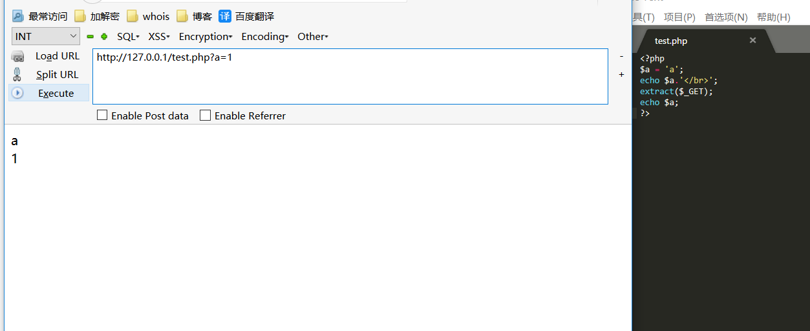
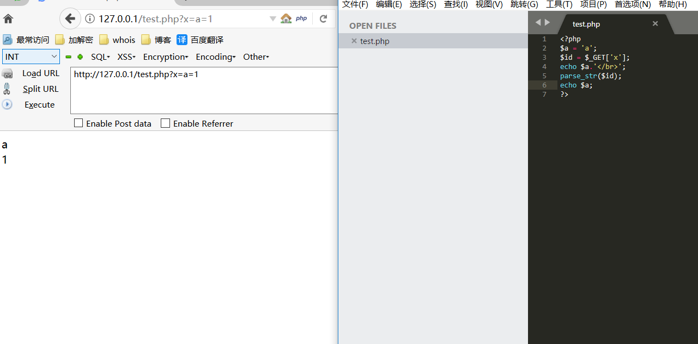
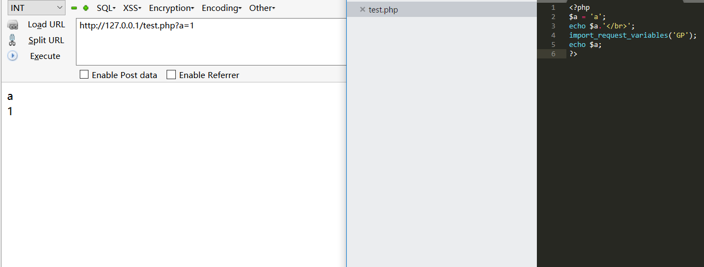
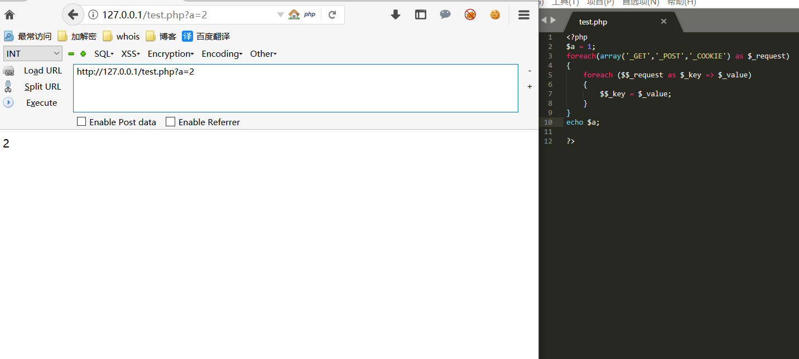
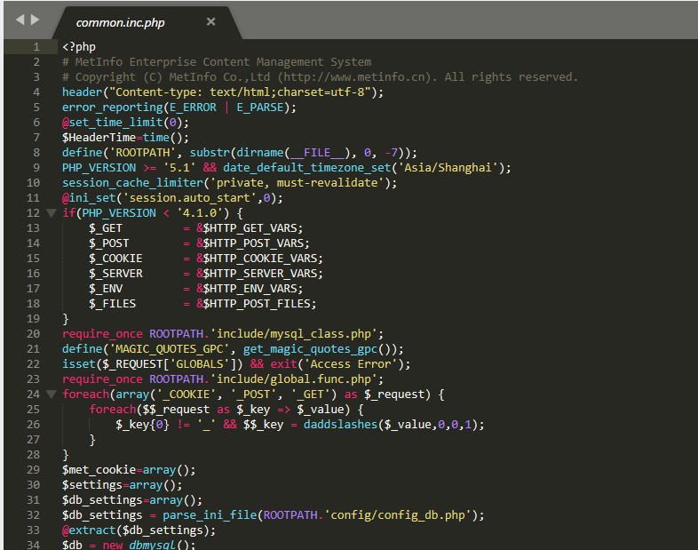
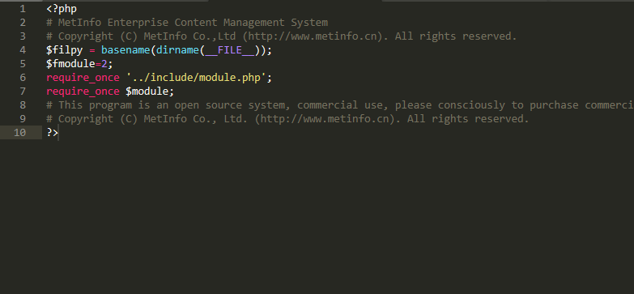
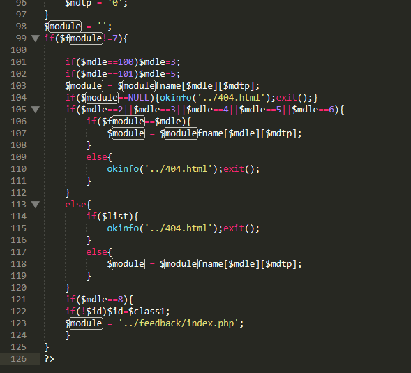
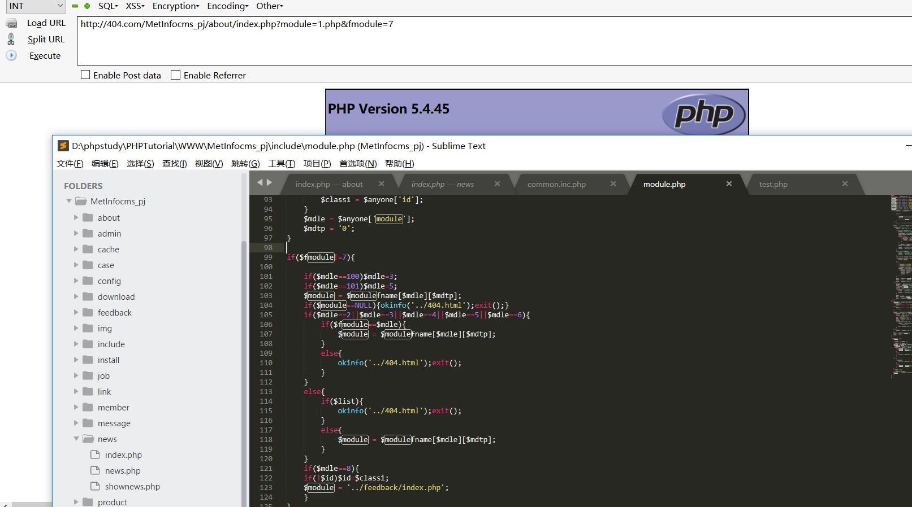

# 0x00 简介

变量覆盖，顾名思义就是可以覆盖已有变量值，导致变量覆盖的漏洞有：`extract()`、`parse_str()`、`import_request_variables()` 使用不当，或者使用了`$$`或者开启了全局变量注册。

# 0x01 变量覆盖演示

**extract()**

`extract(array,extract_rules,prefix)`
函数从数组中将变量导入到当前的符号表，即将数组中的键值对注册成函数，使用数组键名作为变量名，使用数组键值作为变量值。

可以看到我们初始变量值为a但是覆盖之后就变成了我们输入的值。

**parse_str()**

`parse_str() `函数用于把查询字符串解析到变量中，如果没有array 参数，则由该函数设置的变量将覆盖已存在的同名变量。在没有array参数的情况下使用此函数，并且在PHP 7.2中将废弃不设置参数的行为,此函数没有返回值。

**import_request_variables()**

`import_request_variables ( string $types , string $prefix )` 
将 GET／POST／Cookie 变量导入到全局作用域中, types 参数指定需要导入的变量, G代表GET，P代表POST，C代表COOKIE。此函数只能用于PHP4.1 ~ PHP5.4。

**$$**

典型的例子就是foreach来遍历数组中的值作为变量。

其中`$_key`的值为a,那么 `$a`的值就被覆盖为2了。

还有全局注册register_globals这些，php配置默认都是关闭的。

# 0x02 实战审计

本次用到的是MetInfo cms的变量覆盖漏洞，跟进主页来到核心配置文件

\include\common.inc.php

看到文件的24~28行，明显用到了我们上面说的&&变量覆盖的写法，不过这里他用到了`daddslashes()`防注入，不过并不影响我们这章讲的知识。

随便来到一个子文件看看他的加载方式\news\index.php

第7行包含一个变量，那么这个变量在什么地方，我们跟进 include/module.php 看看，在本文件搜索`$module`变量。

这里其实低版本的源码中没有这句话`$module = '';` 其中`$module`变量都在`$fmodule != 7 ` 这个if条件中，我给大家打包的是低版本，我安装错了。 也就是只要我们传入的`$fmodule`的值为7那么我们就可以覆盖这个`$module`的值

只要上传一张图片或者其他文件就可以包含了，因为`require_once`的时候并没有判断他的后缀名。

在变量覆盖的时候一定要注意初始化的值和覆盖的顺序。