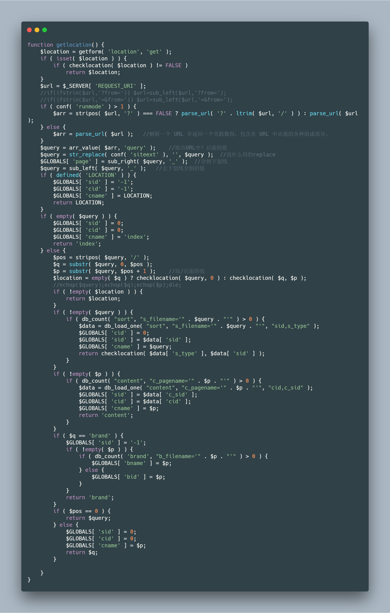
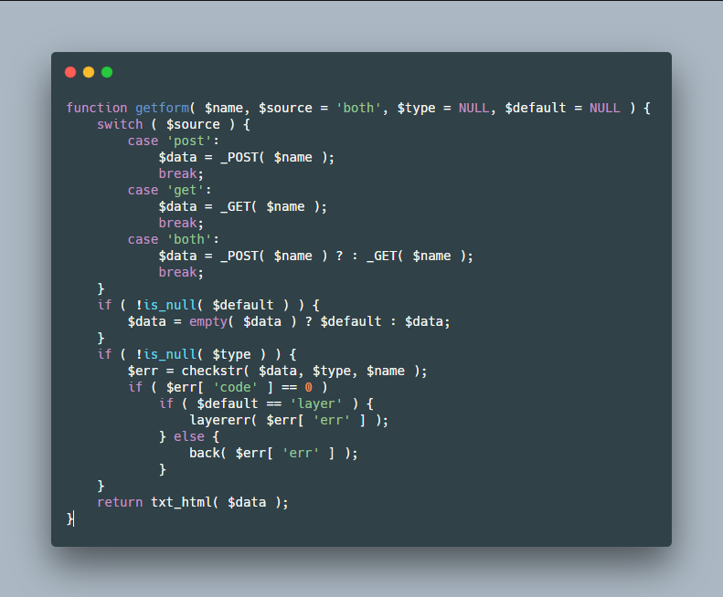
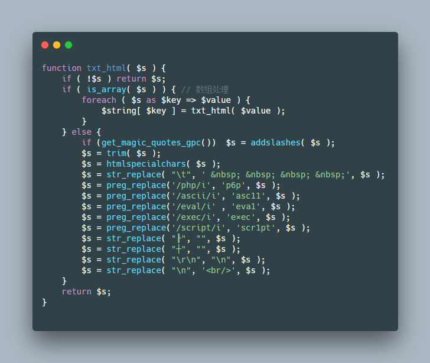
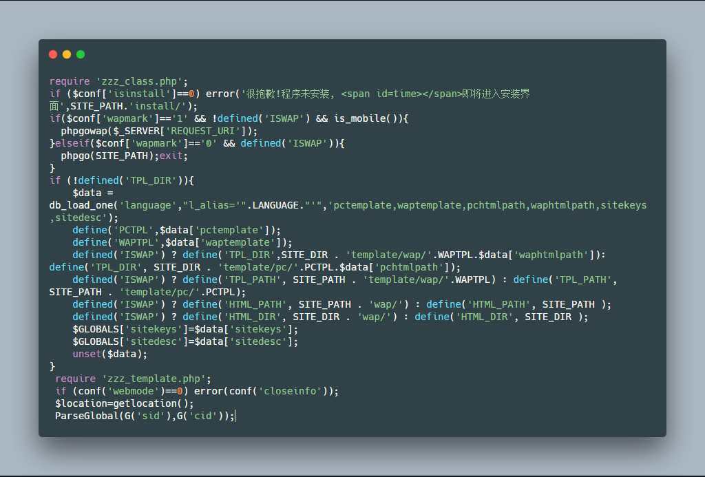
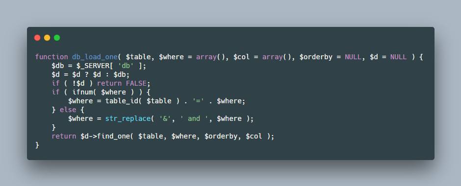
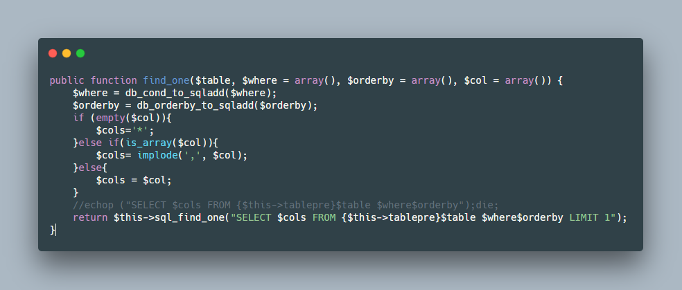
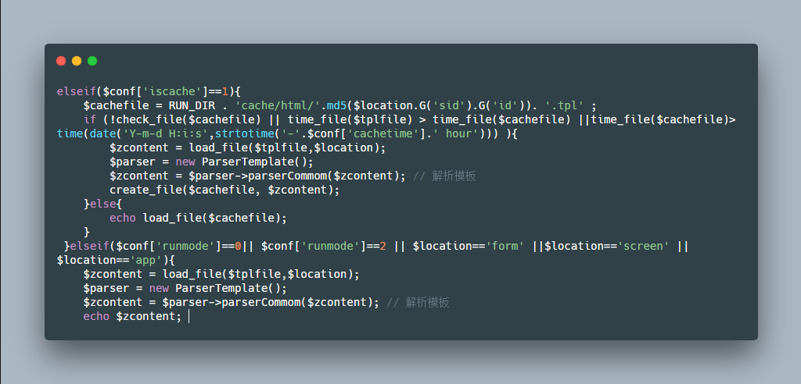
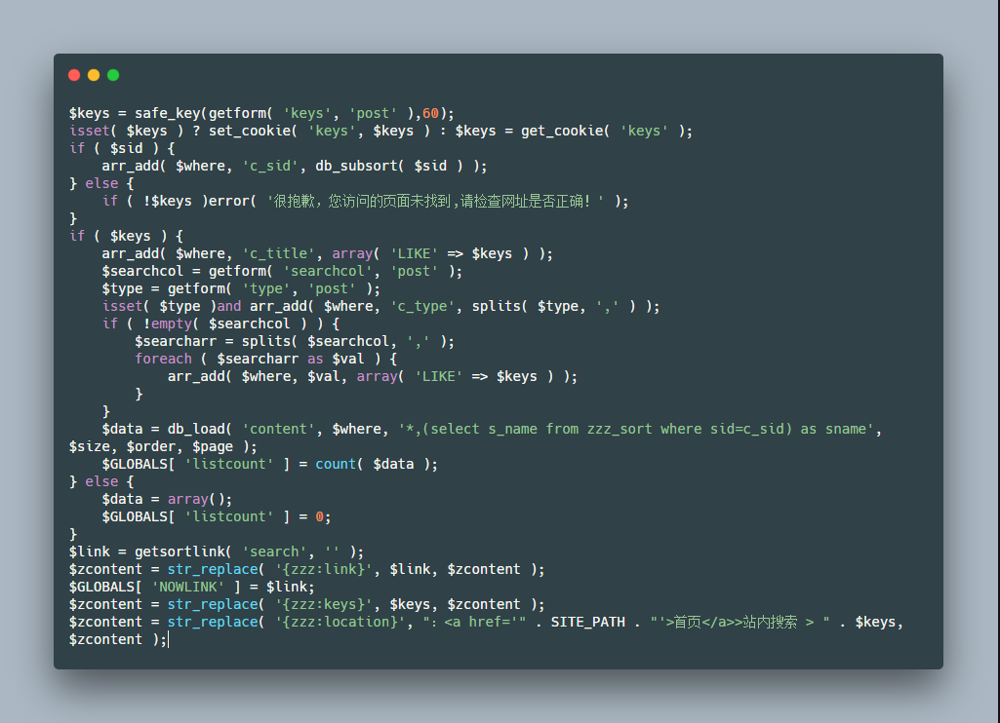

# 0x00 简介

通读全文推荐大家开始可以审计一些比较好看懂的CMS，我们先看大体网站框架，这里你大概知道什么文件夹是放什么类型的文件，然后从`index.php`文件开始往里面读,然后重点关注是否有全局过滤等等。


# 0x01 实例审计

本文用到的源码是zzzphp，我们通过这个程序粗略的了解如何通读全文代码来审计，这里只做简单分析，不深入审计。

## 了解网站框架

```
├─admin             //后台
├─config            //配置文件
├─form              //前台
├─images            //图片
├─inc               //包含文件
├─install           //安装文件
├─js                //js文件
├─plugins           //插件
├─runtime           //临时
├─search            //搜索
├─template          //模板
├─upload            //上传文件夹
└─wap               //手机

```

首先我们看到这个结构，有一点审计基础或者会点英语应该都能看懂这些目录的意思，当然也有个别程序猿喜欢另类一点的命名规则，大体都是这样。


## 了解网站过滤与路由

我觉得全文通读不是无脑的去挨着读，这样比较浪费时间，我们一般应该先去读他的核心文件，一般都在包含文件夹里面，怎么去找核心文件一般是看文件名比如包含`main` `common`等等，也可以看看文件大小一般核心文件包含函数多文件相对较大，还可以通过入口文件一步一步去看，比如这里的核心文件就是`zzz_main.php`我们无非是先关注参数的获取、是否有全局过滤。

我们来到 `\inc\zzz_main.php`

`getlocation()` 解析URL



`getform()`获取参数



过滤函数`txt_html()` 但是通常有关过滤的函数包含一些字符`safe`之类 或者包含函数 `htmlspecialchars()` `addslashes()`



## 了解系统DB类

除了这个文件我们还可以看看`mysql` `db` 之类的关键词文件，看看他数据库连接的方式是否存在宽字节注入的可能，还有他的连接方式。


## 开始审计

看完这些我们就可以从`index.php`一层一层读了。


来到 `index.php` 直接包含文件`inc/zzz_client.php` 先判断`isinstall` 然后执行后面



看到最后一句`ParseGlobal(G('sid'),G('cid'));` 这里调用了`ParseGlobal()` 函数我们可以跟进去看看。

进入if分支

```
if ( $sid > 0 ) {
	$data = db_load_one( 'sort', 'sid=' . $sid );

```

跟进函数`db_load_one()` 这里会把传入的&替换为and



跟进函数 `find_one()`



这里我就不详细跟了只介绍思路，基本上确定这里如果传入的参数没过滤那么这里就会存在注入。

这里跟一下 `G()` 就会发现是`$GLOBALS[ 'sid' ]` 获取的，也就是前面解析url那里获取的值也没有过滤，那么这里基本上就是一个注入了。

读完这些文件我们就可以从各个功能文件夹的index读进去，比如这里我们来到`\search\index.php`

```
<?php
define('LOCATION', 'search');
require dirname(dirname(__FILE__)). '/inc/zzz_client.php';

```

还是回到刚刚我们跟进的文件 `/inc/zzz_client.php` 搜索`search`关键词然后读源码分析

```
	case 'search':
	 	$tplfile= TPL_DIR . 'search.html'; 
		break;

```

看到选中`Search`后赋值给了变量`$tplfile` 然后我们在追踪变量在那个地方被调用过





发现他解析模板的过程，然后跟进`ParserTemplate` 来到`inc\zzz_template.php` 然后往下面读发现一个函数`getform()`



`getform()`函数获取过滤之后还被被 `safe_key()` 函数过滤，但是看到下面还有函数`get_cookie` 看样子也是获取参数的，但是这个用到函数`isset()` 他是一个检测变量的函数，定义了即为true 所以这里根本进不去，不然就是一个注入了,当然这也是一个老版本的注入，我这里的版本已经修复了。接下来还可以从`admin`的`index.php`开始读，多关注一些功能点，推荐可以搭建起来熟悉一下整套程序。


# 0x02 文末

通读这个ZZZCMS 我们可以知道，他在调用`getform()`函数的时候我们基本不考虑注入了，因为已经被过滤了，除非他后面用其他函数处理了一下。在调试复杂语句的时候我们可以通过mysql监控软件来调试。当我们发现一类函数或者写法存在漏洞的时候，可以使用全文搜索，来查找相同的代码对一类进行完整挖掘。