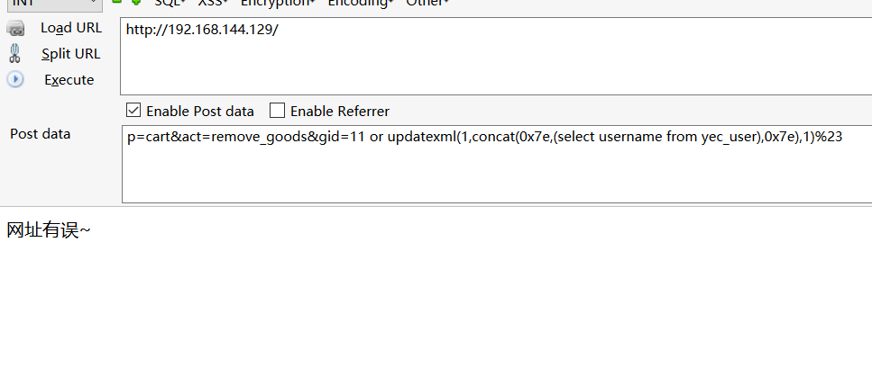

# 0x00 简介

本文审计的系统为云ec电商系统版本1.2.3，网上也有审计文章这里主要是讲讲，有些程序可能本身他的过滤代码还是比较不错，但是逻辑问题造成了过滤函数没有起作用。


# 0x01 实例审计

还是先从index.php文件看进去吧！

```
<?php
define('in_mx', TRUE);

$ym_version='1.2.3';
$p=isset($_GET['p']) ? addslashes($_GET['p']) : '';
$p=(trim($p)=='') ? 'index' : trim($p);

require("./inc/function/global.php");

switch ($p){
	case 'admin':
		include("./inc/function/global_admin".Ext);
		exit();
    break;
    case 'install':
		require("./install/index".Ext);
		exit();
    break;
    default:
		if(strpos($p, "n-")===0 || $ym_url_path[0] === 'news'){
			include("./inc/function/global_news".Ext);
		}
		else{
			include("./inc/function/global_page".Ext);
		}
    break;
}
?>

```
从index.php来看是GET获取P参数然后引用对应的文件，先来看看/inc/function/global.php

```
set_error_handler("customError",E_ERROR);
$getfilter="\\b(and|or)\\b.+?(>|<|=|in|like)|\\/\\*.+?\\*\\/|<\\s*script\\b|\\bEXEC\\b|UNION.+?SELECT|UPDATE.+?SET|INSERT\\s+INTO.+?VALUES|(SELECT|DELETE).+?FROM|(CREATE|ALTER|DROP|TRUNCATE)\\s+(TABLE|DATABASE)";
$postfilter="\\b(and|or)\\b.{1,6}?(=|>|<|\\bin\\b|\\blike\\b)|\\/\\*.+?\\*\\/|<\\s*script\\b|\\bEXEC\\b|UNION.+?SELECT|UPDATE.+?SET|INSERT\\s+INTO.+?VALUES|(SELECT|DELETE).+?FROM|(CREATE|ALTER|DROP|TRUNCATE)\\s+(TABLE|DATABASE)";
$cookiefilter="\\b(and|or)\\b.{1,6}?(=|>|<|\\bin\\b|\\blike\\b)|\\/\\*.+?\\*\\/|<\\s*script\\b|\\bEXEC\\b|UNION.+?SELECT|UPDATE.+?SET|INSERT\\s+INTO.+?VALUES|(SELECT|DELETE).+?FROM|(CREATE|ALTER|DROP|TRUNCATE)\\s+(TABLE|DATABASE)";

function StopAttack($StrFiltKey,$StrFiltValue,$ArrFiltReq){  
	if(is_array($StrFiltValue))
	{
		$StrFiltValue=implode($StrFiltValue);
	}		
	if (preg_match("/".$ArrFiltReq."/is",urldecode($StrFiltValue))){
			print "网址有误~";
			exit();
	}      
}  

foreach($_GET as $key=>$value){
	StopAttack($key,$value,$getfilter);
}
if ($_GET["p"]!=='admin'){
	foreach($_POST as $key=>$value){ 
		StopAttack($key,$value,$postfilter);
	}
}

foreach($_COOKIE as $key=>$value){ 
	StopAttack($key,$value,$cookiefilter);
}
unset($_GET['_SESSION']);
unset($_POST['_SESSION']);
unset($_COOKIE['_SESSION']);

```

这个正则貌似就是copy的360webscan的那个，这里GET、POST、COOKIE都被过滤了的，但是我们看到其中过滤POST的判断

```
if ($_GET["p"]!=='admin'){
	foreach($_POST as $key=>$value){ 
		StopAttack($key,$value,$postfilter);
	}
}
```
如果GET传入的p=admin了就不会进入这个if语句，也达到我们绕过的目的了，然后往下面看

```
if (!empty($_GET)){ foreach($_GET AS $key => $value) $$key = addslashes_yec($value); }
if (!empty($_POST)){ foreach($_POST AS $key => $value) $$key = addslashes_yec($value); }

```
这里我们传入的P参数的值被重新覆盖掉，然后经过`addslashes_yec`函数过滤。然后我们梳理一下审计思路

```
1. 寻找SERVER获取的。
2. 寻找数字型注入，结合上面的绕过，注入密码。

```

先看看前台注入，这个cms注入比较多，我就随便写个了

\inc\module\cart.php

```
	elseif ($act == 'remove_goods') //移除商品
	{		
		$ckey = $ckey ? intval($ckey) : intval($_COOKIE['ckey']);
		$gid_list = explode("@", $gid);
		$spec_list = explode("@", $spec);
		
		$db = dbc();
		$where ='';
		if($ckey != 0)
		{
			$where =' and cid='.$ckey;
		}
		elseif($ym_uid !=0)
		{
			$where =' and uid='.$ym_uid;
		}
		else {
			$res['err'] = '请刷新页面再试';
			die(json_encode_yec($res));
		}
		
		foreach ($gid_list as $k => $v) {
			$sp = $spec_list[$k];
			if(intval($v)<=0)
			{
				continue;
			}			
									
			$db->query("delete i FROM ".$db->table('cart')." c join ".$db->table('cart_item')." i on c.id=i.cid where gid=".$v." and spec='".$sp."' ".$where);
		}
		
		$cnum = get_cart_amount(1);
		$res['res'] = $cnum;
		$time = time() + 15552000;				
		set_cookie('cnum',  $cnum, $time); //购物车数量
		die(json_encode_yec($res));
	}	

```

其中传入的$gid经过`explode`函数分割（这里sql语句中不能使用@字符），然后foreach循环取出来后带入sql语句，也没有单双引号之类的包裹，比较明显的一处注入了。



如果没用绕过是会触发360webscan的


# 0x02 文末

这套程序在1.2.4这里修复了这个逻辑方面的问题貌似漏洞就没啥了。本版本还有很多注入大家可以自己审计一下，也可以看看水泡泡巨佬的https://www.cnblogs.com/r00tuser/p/9014869.html